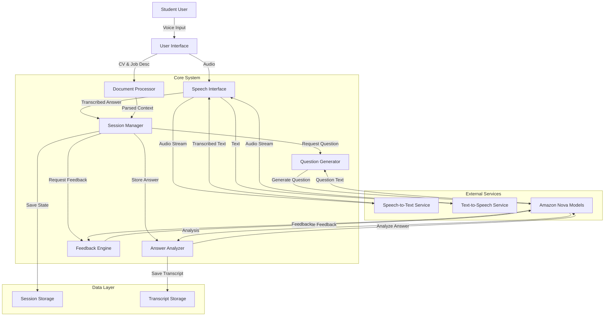

# Design Document: Realtime Mock Interview Application

## Overview

The Realtime Mock Interview Application is a voice-driven AI interview system that provides students with realistic interview practice. The system architecture follows a modular design with clear separation between speech processing, AI-powered question generation, session management, and feedback delivery.

The application flow consists of:
1. Input processing (CV and job description parsing)
2. Interview initialization with context extraction
3. Real-time question generation using Amazon Nova 2 Sonic
4. Voice-based question delivery and answer capture
5. Adaptive follow-up question generation based on responses
6. Interview termination detection
7. Comprehensive feedback generation and delivery

The system leverages Amazon Nova models throughout for intelligent processing, with Nova 2 Sonic handling real-time conversational tasks and other Nova variants for summarization and evaluation.

## Architecture

### High-Level Architecture



### Component Responsibilities

**Session Manager**: Orchestrates the entire interview flow, maintains conversation state, determines question sequencing, and handles interview lifecycle.

**Speech Interface**: Manages all audio I/O operations, integrates with speech-to-text and text-to-speech services, handles audio streaming and buffering.

**Question Generator**: Creates contextually relevant interview questions using Nova 2 Sonic based on CV, job description, and previous conversation history.

**Answer Analyzer**: Processes and stores candidate responses, performs real-time analysis to inform follow-up questions.

**Feedback Engine**: Generates comprehensive performance evaluation using Nova models after interview completion.

**Document Processor**: Extracts structured information from CV and job description documents.

## Components and Interfaces

### Document Processor

**Purpose**: Extract and structure information from input documents.

**Interface**:
```
processCV(document: File) -> CVContext
  Input: CV document (PDF, DOCX, or TXT)
  Output: Structured CV data including skills, experience, education
  
processJobDescription(document: File) -> JobContext
  Input: Job description document
  Output: Structured job requirements including required skills, responsibilities, qualifications
  
extractKeyInformation(cvContext: CVContext, jobContext: JobContext) -> InterviewContext
  Input: Parsed CV and job description
  Output: Combined context highlighting alignment and gaps
```

**Implementation Notes**:
- Use document parsing libraries appropriate to file format (PyPDF2, python-docx, etc.)
- Extract key sections: skills, experience, education, certifications from CV
- Extract requirements, responsibilities, qualifications from job description
- Identify skill matches and gaps between CV and job requirements

### Speech Interface

**Purpose**: Handle all voice input/output operations.

**Interface**:
```
startListening() -> AudioStream
  Output: Active audio stream for capturing candidate speech
  
stopListening() -> void
  Effect: Stops audio capture
  
transcribeSpeech(audioStream: AudioStream) -> TranscriptionResult
  Input: Audio stream from microphone
  Output: Transcribed text with confidence score
  
speakText(text: String) -> void
  Input: Text to be spoken
  Effect: Converts text to speech and plays audio
  
detectTerminationCommand(text: String) -> Boolean
  Input: Transcribed text
  Output: True if termination phrase detected
```

**Implementation Notes**:
- Integrate with AWS Transcribe for speech-to-text
- Integrate with AWS Polly for text-to-speech
- Use streaming APIs for real-time processing
- Implement voice activity detection to determine when candidate stops speaking
- Handle audio buffering and chunking for optimal latency
- Termination phrases: "end the interview", "stop interview", "finish interview"

### Session Manager

**Purpose**: Orchestrate interview flow and maintain state.

**Interface**:
```
initializeSession(cvContext: CVContext, jobContext: JobContext) -> SessionID
  Input: Parsed CV and job description contexts
  Output: Unique session identifier
  Effect: Creates new interview session with initial state
  
getCurrentQuestion() -> Question
  Output: Current active question
  
recordAnswer(sessionID: SessionID, questionID: String, answer: String, timestamp: DateTime) -> void
  Input: Session ID, question ID, transcribed answer, timestamp
  Effect: Stores answer and updates session state
  
shouldAskFollowUp(sessionID: SessionID) -> Boolean
  Input: Session ID
  Output: True if follow-up question should be asked based on last answer
  
requestNextQuestion(sessionID: SessionID) -> Question
  Input: Session ID
  Output: Next question to ask (either follow-up or new topic)
  
finalizeSession(sessionID: SessionID) -> InterviewTranscript
  Input: Session ID
  Output: Complete interview transcript
  Effect: Marks session as complete
  
getSessionState(sessionID: SessionID) -> SessionState
  Input: Session ID
  Output: Current session state including history and metadata
```

**State Management**:
```
SessionState:
  - sessionID: String
  - cvContext: CVContext
  - jobContext: JobContext
  - conversationHistory: List<QAPair>
  - currentQuestion: Question
  - startTime: DateTime
  - status: Enum(ACTIVE, COMPLETED, ERROR)
  - questionCount: Integer
  - topicsCovered: Set<String>
```

### Question Generator

**Purpose**: Generate intelligent, contextual interview questions.

**Interface**:
```
generateInitialQuestions(interviewContext: InterviewContext) -> List<Question>
  Input: Combined CV and job context
  Output: Initial set of interview questions (3-5 questions)
  
generateFollowUpQuestion(questionHistory: List<QAPair>, lastAnswer: String) -> Question
  Input: Conversation history and most recent answer
  Output: Follow-up question probing deeper into the topic
  
generateNextTopicQuestion(interviewContext: InterviewContext, topicsCovered: Set<String>) -> Question
  Input: Interview context and topics already covered
  Output: Question on a new relevant topic
```

**Nova Integration**:
```
callNovaForQuestion(prompt: String, context: InterviewContext) -> String
  Input: Structured prompt and interview context
  Output: Generated question text from Nova 2 Sonic
  
buildQuestionPrompt(context: InterviewContext, conversationHistory: List<QAPair>, intent: QuestionIntent) -> String
  Input: Context, history, and intent (initial/followup/new_topic)
  Output: Formatted prompt for Nova model
```

**Question Types**:
- Technical skills questions (based on CV skills and job requirements)
- Behavioral questions (STAR format scenarios)
- Experience-based questions (probing specific CV entries)
- Role-specific questions (based on job description)
- Follow-up probing questions (based on previous answers)

### Answer Analyzer

**Purpose**: Process and analyze candidate responses.

**Interface**:
```
storeAnswer(sessionID: SessionID, questionID: String, answerText: String, timestamp: DateTime) -> AnswerRecord
  Input: Session ID, question ID, answer text, timestamp
  Output: Stored answer record with metadata
  
analyzeAnswerQuality(answer: String, question: String, context: InterviewContext) -> AnswerAnalysis
  Input: Answer text, question, interview context
  Output: Analysis including relevance, completeness, key points mentioned
  
extractKeyPoints(answer: String) -> List<String>
  Input: Answer text
  Output: Key points and topics mentioned in answer
```

**Data Structures**:
```
AnswerRecord:
  - answerID: String
  - sessionID: String
  - questionID: String
  - answerText: String
  - timestamp: DateTime
  - keyPoints: List<String>
  - analysis: AnswerAnalysis

AnswerAnalysis:
  - relevanceScore: Float (0-1)
  - completeness: Enum(INCOMPLETE, PARTIAL, COMPLETE)
  - keyTopicsMentioned: List<String>
  - suggestedFollowUps: List<String>
```

### Feedback Engine

**Purpose**: Generate comprehensive interview feedback.

**Interface**:
```
generateFeedback(sessionID: SessionID, transcript: InterviewTranscript) -> FeedbackReport
  Input: Session ID and complete interview transcript
  Output: Comprehensive feedback report
  
evaluatePerformance(transcript: InterviewTranscript, jobContext: JobContext) -> PerformanceScore
  Input: Interview transcript and job requirements
  Output: Performance scores across multiple dimensions
  
identifyStrengths(transcript: InterviewTranscript) -> List<Strength>
  Input: Interview transcript
  Output: Identified strengths with examples
  
identifyImprovements(transcript: InterviewTranscript) -> List<Improvement>
  Input: Interview transcript
  Output: Areas for improvement with recommendations
```

**Nova Integration**:
```
callNovaForEvaluation(transcript: InterviewTranscript, jobContext: JobContext) -> EvaluationResult
  Input: Complete transcript and job context
  Output: Structured evaluation from Nova model
  
summarizePerformance(evaluationResult: EvaluationResult) -> String
  Input: Structured evaluation
  Output: Human-readable performance summary
```

**Feedback Structure**:
```
FeedbackReport:
  - overallScore: Float (0-100)
  - dimensionScores: Map<Dimension, Float>
    - Technical Knowledge
    - Communication Clarity
    - Answer Completeness
    - Behavioral Competencies
    - Role Alignment
  - strengths: List<Strength>
  - improvements: List<Improvement>
  - summary: String
  - detailedAnalysis: String

Strength:
  - category: String
  - description: String
  - example: String (quote from transcript)

Improvement:
  - category: String
  - issue: String
  - recommendation: String
  - example: String (quote from transcript)
```

## Data Models

### Core Data Structures

```
CVContext:
  - skills: List<Skill>
  - experience: List<Experience>
  - education: List<Education>
  - certifications: List<Certification>
  - summary: String

Skill:
  - name: String
  - proficiency: Enum(BEGINNER, INTERMEDIATE, ADVANCED, EXPERT)
  - yearsOfExperience: Integer

Experience:
  - company: String
  - role: String
  - duration: DateRange
  - responsibilities: List<String>
  - achievements: List<String>

Education:
  - institution: String
  - degree: String
  - field: String
  - graduationDate: Date

JobContext:
  - title: String
  - requiredSkills: List<String>
  - preferredSkills: List<String>
  - responsibilities: List<String>
  - qualifications: List<String>
  - experienceLevel: Enum(ENTRY, MID, SENIOR, LEAD)

InterviewContext:
  - cvContext: CVContext
  - jobContext: JobContext
  - skillMatches: List<String>
  - skillGaps: List<String>
  - relevantExperiences: List<Experience>

Question:
  - questionID: String
  - text: String
  - type: Enum(TECHNICAL, BEHAVIORAL, EXPERIENCE, ROLE_SPECIFIC)
  - topic: String
  - isFollowUp: Boolean
  - parentQuestionID: String (if follow-up)

QAPair:
  - question: Question
  - answer: AnswerRecord
  - timestamp: DateTime

InterviewTranscript:
  - sessionID: String
  - cvContext: CVContext
  - jobContext: JobContext
  - qaPairs: List<QAPair>
  - startTime: DateTime
  - endTime: DateTime
  - duration: Duration
  - totalQuestions: Integer
```

### Storage Schema

**Session Storage**:
- Key: sessionID
- Value: SessionState (JSON serialized)
- TTL: 24 hours

**Transcript Storage**:
- Key: sessionID
- Value: InterviewTranscript (JSON serialized)
- Persistent storage for historical analysis

## Correctness Properties

*A property is a characteristic or behavior that should hold true across all valid executions of a system—essentially, a formal statement about what the system should do. Properties serve as the bridge between human-readable specifications and machine-verifiable correctness guarantees.*


### Property 1: Document Extraction Completeness
*For any* valid CV and job description documents, the extracted context should contain all required fields including skills, experience, qualifications, and role requirements.

**Validates: Requirements 1.3**

### Property 2: Invalid Document Error Handling
*For any* invalid or unreadable document input, the system should return a descriptive error message without crashing.

**Validates: Requirements 1.4**

### Property 3: Question-to-Speech Conversion
*For any* generated question text, the Speech Interface should successfully convert it to audio output.

**Validates: Requirements 2.1**

### Property 4: Speech State Blocking
*For any* interview session, while the system is speaking a question, the system should not accept or process candidate audio input.

**Validates: Requirements 2.3**

### Property 5: Sequential Question Delivery
*For any* interview session, questions should be delivered one at a time without overlapping, maintaining sequential order.

**Validates: Requirements 2.4**

### Property 6: Listening State Activation
*For any* question delivery completion, the system should immediately transition to listening state to capture the candidate's response.

**Validates: Requirements 3.1**

### Property 7: Continuous Audio Capture
*For any* active listening session, audio capture should remain active continuously until speech end is detected.

**Validates: Requirements 3.2**

### Property 8: Speech-to-Text Failure Recovery
*For any* speech-to-text conversion failure, the system should request the candidate to repeat their answer and retry capture.

**Validates: Requirements 3.4**

### Property 9: Answer Storage Round-Trip
*For any* transcribed answer, storing it and then retrieving it should preserve the complete text and timestamp.

**Validates: Requirements 3.5, 9.1**

### Property 10: Nova Context Inclusion for Questions
*For any* question generation request, the call to Nova should include both CV context and job description context (for initial questions) or conversation history (for follow-up questions).

**Validates: Requirements 4.1, 4.2**

### Property 11: Follow-Up Topic Relevance
*For any* follow-up question generated after a candidate mentions specific topics, the follow-up question should reference those mentioned topics.

**Validates: Requirements 4.3**

### Property 12: Question Type Diversity
*For any* complete interview session with 5+ questions, the generated questions should span at least 2 different question types (technical, behavioral, experience-based, or role-specific).

**Validates: Requirements 4.4**

### Property 13: Session Initialization Completeness
*For any* interview start request with CV and job description, a new session should be created containing both contexts and initialized state.

**Validates: Requirements 5.1**

### Property 14: Conversation History Preservation
*For any* question-answer pair added during an interview, that pair should appear in the session's conversation history when retrieved.

**Validates: Requirements 5.3**

### Property 15: Session Metadata Tracking
*For any* interview session, the session state should maintain accurate question count and duration from start to current time.

**Validates: Requirements 5.4**

### Property 16: Session State Consistency
*For any* interview session in progress, retrieving the session state should return consistent data including all Q&A pairs, context, and metadata.

**Validates: Requirements 5.5**

### Property 17: Termination Command Detection
*For any* termination phrase ("end the interview", "stop interview", "finish interview"), the system should immediately stop asking questions and transition to finalization.

**Validates: Requirements 6.1, 6.4**

### Property 18: Session Finalization on Termination
*For any* detected termination command, the session status should change from ACTIVE to COMPLETED.

**Validates: Requirements 6.2**

### Property 19: Feedback Generation Trigger
*For any* interview termination, the system should invoke the Feedback Engine with the complete interview transcript.

**Validates: Requirements 6.3, 7.1**

### Property 20: Feedback Structure Completeness
*For any* generated feedback report, it should contain all required components: overall score, dimension scores, strengths list, improvements list, and summary text.

**Validates: Requirements 7.2, 7.3, 7.4, 7.6**

### Property 21: Dual-Format Feedback Delivery
*For any* generated feedback, it should be available in both text format and speech format.

**Validates: Requirements 7.5**

### Property 22: Nova API Error Handling
*For any* Nova API call failure, the system should handle the error gracefully without crashing and provide appropriate user feedback or retry logic.

**Validates: Requirements 8.4**

### Property 23: Answer-Question Association Integrity
*For any* stored answer, retrieving it should return the correct associated question ID, and retrieving that question should return the original question.

**Validates: Requirements 9.2**

### Property 24: Complete Transcript Preservation
*For any* completed interview session, the final transcript should contain exactly the same number of Q&A pairs as were recorded during the session.

**Validates: Requirements 9.3, 9.4**

### Property 25: Error Recovery with State Preservation
*For any* critical error that prevents continuation, the system should save the current session state, and that state should be retrievable for potential resumption.

**Validates: Requirements 10.4**

### Property 26: Error Notification Consistency
*For any* recoverable error (speech recognition failure, audio capture failure, API unavailability), the system should provide an error notification to the user and attempt recovery.

**Validates: Requirements 10.1, 10.2, 10.3**

## Error Handling

### Error Categories

**Input Errors**:
- Invalid document format
- Unreadable or corrupted files
- Missing required fields in documents
- Response: Return descriptive error message, request valid input

**Speech Processing Errors**:
- Speech-to-text service unavailable
- Audio capture device failure
- Transcription confidence too low
- No speech detected within timeout
- Response: Notify user, request repeat, retry with exponential backoff

**AI Model Errors**:
- Nova API unavailable or timeout
- Rate limiting exceeded
- Invalid response format from model
- Response: Retry with exponential backoff (max 3 attempts), inform user if persistent, save session state

**Session Errors**:
- Session not found
- Session expired
- Invalid session state
- Response: Inform user, offer to start new session

**Storage Errors**:
- Failed to save session state
- Failed to retrieve transcript
- Storage quota exceeded
- Response: Retry operation, log error, inform user if persistent

### Error Recovery Strategies

**Retry Logic**:
- Exponential backoff: 1s, 2s, 4s
- Maximum 3 retry attempts
- Different strategies for different error types

**State Preservation**:
- Save session state before critical operations
- Checkpoint after each Q&A pair
- Enable session resumption after recoverable errors

**User Communication**:
- Clear error messages without technical jargon
- Actionable instructions for user
- Progress indication during retries

**Graceful Degradation**:
- If TTS fails, provide text-only output
- If STT fails, offer text input fallback
- If Nova fails, use cached questions or end gracefully

## Testing Strategy

### Dual Testing Approach

The testing strategy employs both unit testing and property-based testing to ensure comprehensive coverage:

**Unit Tests**: Focus on specific examples, edge cases, integration points, and error conditions. Unit tests validate concrete scenarios and ensure components work correctly in isolation and together.

**Property Tests**: Verify universal properties that should hold across all inputs. Property tests use randomized input generation to validate correctness properties defined in this design document.

Together, these approaches provide comprehensive coverage where unit tests catch concrete bugs and property tests verify general correctness across the input space.

### Property-Based Testing Configuration

**Framework Selection**:
- Python: Use Hypothesis library for property-based testing
- TypeScript/JavaScript: Use fast-check library
- Other languages: Select appropriate PBT framework

**Test Configuration**:
- Minimum 100 iterations per property test (due to randomization)
- Each property test must include a comment tag referencing the design property
- Tag format: `# Feature: realtime-mock-interview, Property {N}: {property title}`

**Property Test Implementation**:
- Each correctness property listed above must be implemented as a single property-based test
- Tests should generate random valid inputs appropriate to the property
- Tests should verify the property holds for all generated inputs
- Tests should fail fast with clear counterexamples when properties are violated

### Unit Testing Focus Areas

**Document Processing**:
- Test parsing of PDF, DOCX, and TXT formats
- Test extraction of skills, experience, education sections
- Test handling of malformed documents
- Test edge cases: empty documents, very large documents, special characters

**Speech Interface**:
- Test audio stream handling
- Test transcription integration with AWS Transcribe
- Test TTS integration with AWS Polly
- Test termination command detection with various phrasings
- Mock external services for isolated testing

**Session Management**:
- Test session lifecycle: initialization, active, completed
- Test state transitions
- Test conversation history management
- Test concurrent session handling

**Question Generation**:
- Test Nova API integration
- Test prompt construction for different question types
- Test follow-up logic based on answer content
- Mock Nova responses for deterministic testing

**Answer Analysis**:
- Test answer storage and retrieval
- Test key point extraction
- Test answer-question association

**Feedback Generation**:
- Test feedback structure completeness
- Test scoring across multiple dimensions
- Test strength and improvement identification
- Mock Nova responses for deterministic testing

**Error Handling**:
- Test retry logic with exponential backoff
- Test state preservation on errors
- Test graceful degradation scenarios
- Test error message clarity

### Integration Testing

**End-to-End Flow**:
- Test complete interview flow from document input to feedback delivery
- Test termination at various points in the interview
- Test session resumption after errors
- Use recorded audio samples for reproducible tests

**External Service Integration**:
- Test AWS Transcribe integration with real audio samples
- Test AWS Polly integration with various text inputs
- Test Amazon Nova integration with real prompts
- Use service mocks for CI/CD pipeline

**Performance Testing**:
- Test latency of speech-to-text conversion
- Test response time of question generation
- Test concurrent session capacity
- Test memory usage during long interviews

### Test Data Generation

**For Property Tests**:
- Generate random CV content with varying skills and experience
- Generate random job descriptions with varying requirements
- Generate random conversation histories
- Generate random audio transcriptions
- Generate random session states

**For Unit Tests**:
- Curate representative CV samples
- Curate representative job descriptions
- Create edge case documents (empty, malformed, very long)
- Record sample audio for speech testing
- Create error scenarios for each error type

### Coverage Goals

- Line coverage: >80% for core business logic
- Branch coverage: >75% for conditional logic
- Property coverage: 100% of defined correctness properties
- Error path coverage: All error handling paths tested

### Continuous Testing

- Run unit tests on every commit
- Run property tests on every pull request
- Run integration tests nightly
- Run performance tests weekly
- Monitor test execution time and flakiness
